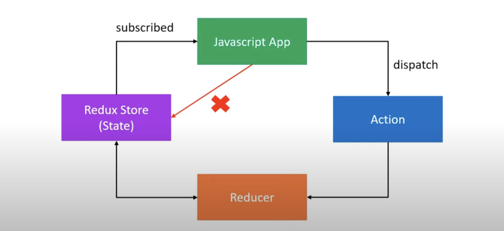

**REDUX BASIC**

Basic of Redux

1. The Global state of your application is stored as an object inside a single store.
2. The only way to change the state is to dispatch an action, an object that described what happened.
3. To specify how the state tree is updated based on actions, you write pure reducers.

ACTIONS
1. Actions are plain JavaScript objects that have a type field.
2. you can think of action as an event that describes something that happened in the application.